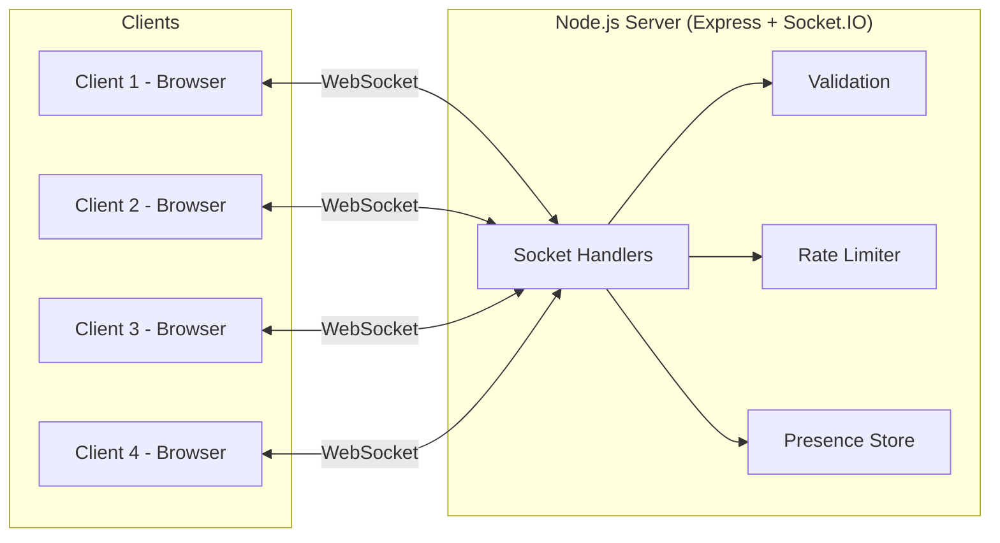
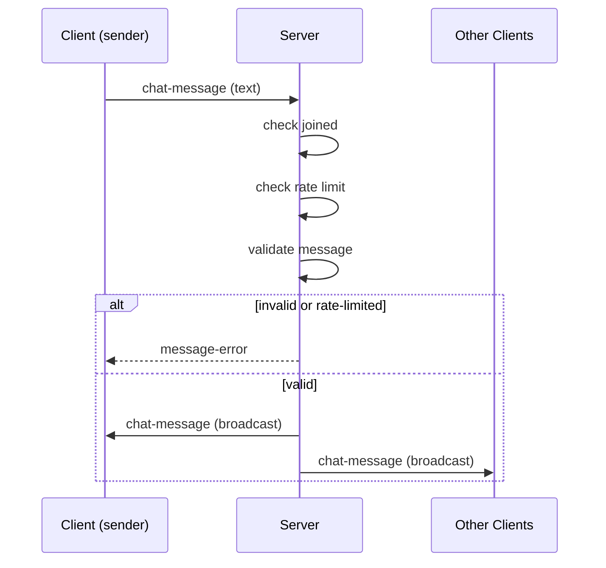

# CSD Group Chat

Real-time group chat application built with WebSockets (Socket.IO). One backend
server, multiple browser clients — everyone in one shared room.

## MVP features

- Join with a username
- Real-time message broadcast to everyone in the room
- Join / leave notifications
- Live online-users list
- Graceful handling of client disconnects (tab close, refresh, network drop)

## Running the server

```bash
cd server
npm install
npm start
```

The server starts on `http://localhost:3000` and also serves the frontend
(`client/`), so there's nothing separate to run for the UI.

## Connecting from lab machines

1. Pick one machine to run the server (steps above).
2. Find that machine's LAN IP (`hostname -I` on Linux, `ipconfig` on Windows).
3. On the other 3 machines, open `http://<server-ip>:3000` in a browser.
4. Everyone enters a username and joins the same room.

Make sure the server machine's firewall allows inbound connections on port
`3000`, and that all machines are on the same network.

## Architecture

One Node.js server handles every client over WebSockets (via Socket.IO).
There is a single shared room — every message is broadcast to everyone
connected.



Message flow for a single chat message:



## Project structure

```
server/   Express + Socket.IO backend (message broadcast, join/leave, disconnects)
client/   Static HTML/CSS/JS frontend (no build step required)
```

## Roadmap (post-MVP)

- Message history / persistence
- Private (1:1) messaging
- Typing indicators
- Improved styling / mobile layout
