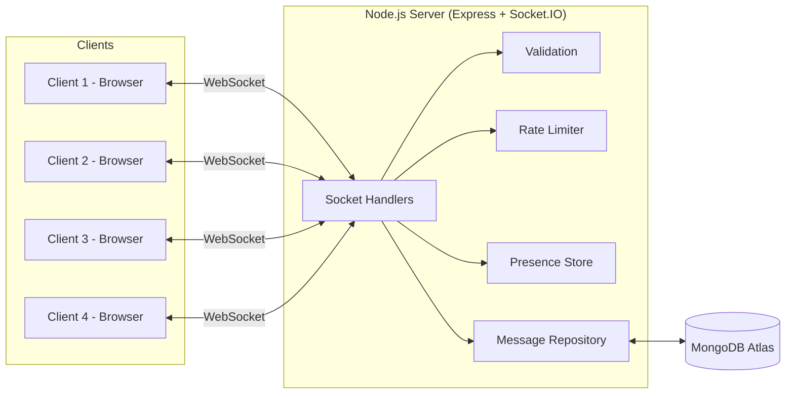
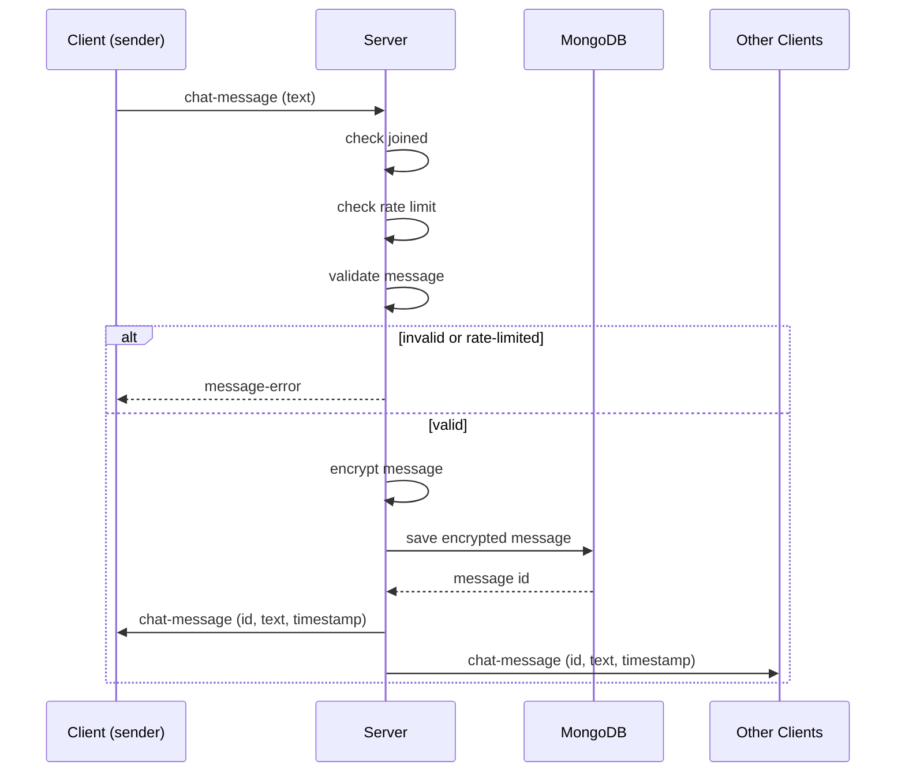
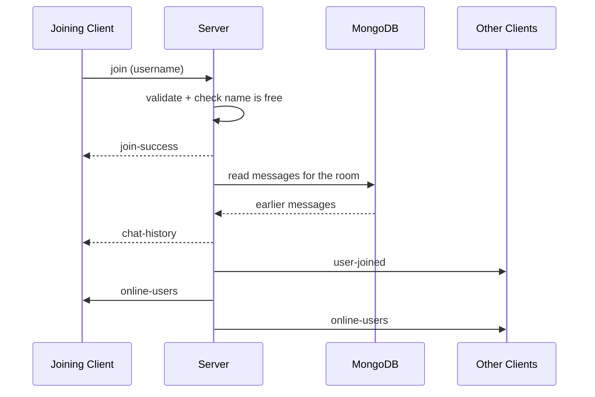

# CSD Group Chat

Real-time group chat application built with WebSockets (Socket.IO), with
messages stored in MongoDB. One backend server, multiple browser clients —
everyone in one shared room.

## MVP features

- Join with a username (unique while you are online)
- Real-time message broadcast to everyone in the room
- Messages saved to MongoDB, so they survive a server restart
- New joiners receive the earlier messages in the room
- Join / leave notifications with timestamps
- Live online-users list
- "User is typing..." indicator
- Graceful handling of client disconnects (tab close, refresh, network drop)
- Messages encrypted in the database (AES-256-GCM), with edited messages flagged
  in the chat instead of shown as text

A username can only be online once. Joining from a second tab with a name that
is already in use is rejected on the join screen; use a different name, or
close the first tab to free it. See `server/README.md` for details.

## Setting up the database

Messages are stored in MongoDB Atlas (the free M0 tier is enough for this).

1. Create a free account at [mongodb.com/atlas](https://www.mongodb.com/atlas)
   and create an **M0 (free)** cluster.
2. Under **Database Access**, add a database user with a password.
3. Under **Network Access**, add the IP address of the machine that will run the
   server. If you are moving between lab machines, add each one. A connection
   that hangs and then times out is almost always a missing entry here.
4. Open **Cluster → Connect → Drivers → Node.js** and copy the connection string.
5. Create your local config file:

   ```bash
   cd server
   cp .env.example .env
   ```

   Open `server/.env` and paste the connection string into `MONGODB_URI`,
   replacing `<password>` with the database user's password.
6. Generate the key used to encrypt stored messages and paste it into the same
   file:

   ```bash
   npm run generate-key
   ```

`server/.env` is ignored by git, so neither the connection string nor the
encryption key is ever committed. Everyone running the server needs their own
copy of this file.

Everyone sharing one database has to share the same `CHAT_ENCRYPTION_KEY`, since
messages can only be read with the key they were written under. Generate it once
and pass it around with the connection string.

## Running the server

The frontend is a React app that needs to be built once before the server
can serve it:

```bash
cd client
npm install
npm run build
```

Then start the backend:

```bash
cd server
npm install
npm start
```

The server checks the encryption key and connects to MongoDB before it starts
accepting clients. If `CHAT_ENCRYPTION_KEY` or `MONGODB_URI` is missing or
wrong, it stops with a message saying so rather than starting up and losing
messages.

The server starts on `http://localhost:4000` and also serves the built
frontend (`client/dist`), so there's nothing separate to run for the UI.
For frontend development with hot reload, see `client/README.md`.

## Ports

| Port | What runs there | When |
|---|---|---|
| `4000` | The chat server (Express + Socket.IO), which also serves the built client | Always |
| `3000` | The client dev server (Vite), with hot reload | Only during frontend development |

During development both run at once: Vite on 3000 serves the UI and forwards
`/socket.io` and `/health` to the chat server on 4000. For the lab demo you only
need the chat server, since it serves the built client itself.

Set `PORT` in `server/.env` to move the chat server somewhere else.

## Connecting from lab machines

1. Pick one machine to run the server (steps above).
2. Find that machine's LAN IP:
   - Linux: `hostname -I`
   - Windows: `ipconfig`
3. On the other 3 machines, open `http://<server-ip>:4000` in a browser.
4. Everyone enters a username and joins the same room.
5. If the browser cannot connect, check that the server machine allows inbound
   traffic on port `4000` and that all lab machines are on the same network
   segment or VPN.

This project was validated on a multi-machine lab setup with one shared backend
and four browser clients. The practical steps above reflect the actual working
pattern used during testing, rather than a purely localhost-only setup.

## Reconnection and reliability

The app is designed to recover cleanly after a brief network interruption.
When a client loses connectivity and reconnects, it reuses the stored username,
rejoins the chat, and shows a system message confirming the reconnect.

A visible connection indicator is shown in the chat UI:
- Connected
- Reconnecting...
- Disconnected

This makes it easier to confirm that the websocket connection is healthy during
lab demonstrations and troubleshooting.

## Architecture

One Node.js server handles every client over WebSockets (via Socket.IO).
There is a single shared room — every message is broadcast to everyone
connected, and every message is stored in MongoDB.

The WebSocket gives us real-time delivery; the database gives us history.



Message flow for a single chat message. The message is stored before it is
broadcast, so anything a client receives is already saved:



What a user gets when they join:



## Project structure

```
server/   Express + Socket.IO backend (message broadcast, join/leave, disconnects, MongoDB storage)
client/   React + TypeScript + shadcn/ui frontend (build with `npm run build`)
```

## Testing and verification

Use the steps in [TESTING.md](TESTING.md) for a repeatable end-to-end check of the
join, broadcast, leave, and disconnect flow. The assignment requirement is to
verify all four people can participate at the same time, and that a temporary
network drop does not leave the client stuck in a broken state.

## Message history

Every message is written to MongoDB before it is sent out, so the conversation
is not lost when the server stops. When someone joins, the server reads the
recent messages for the room and sends them to that person only, so they can
catch up on what was said before they arrived.

History is sent again whenever a client rejoins, including after a reconnect.
Each message carries the id it was stored under, and the client ignores ids it
already has, so a brief network drop does not show the conversation twice.

## Encryption at rest

Messages are encrypted with AES-256-GCM before they reach the database and
decrypted again when history is read, so a look at the collection shows binary
rather than the conversation. Each message gets its own random nonce, and the
authentication tag stored alongside it is what makes editing a stored message
detectable: it no longer decrypts, and the client shows it as failing
verification rather than showing text nobody sent.

Live messages still travel over the socket as text. The point here is that the
database holds nothing readable, not that clients cannot read their own chat.

The key lives in `CHAT_ENCRYPTION_KEY` in `server/.env`, and `server/README.md`
covers the details, including `npm run tamper-demo` for demonstrating the
detection.

## Roadmap (post-MVP)

- Per-sender signing keys so message authorship can be verified
- Private (1:1) messaging
- Improved styling / mobile layout
