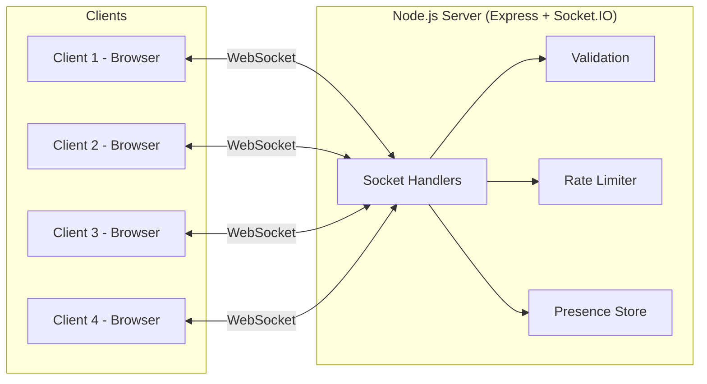
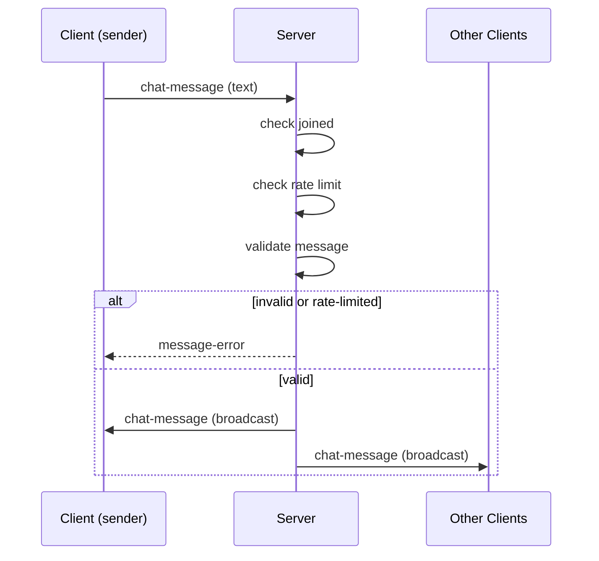

# CSD Group Chat

Real-time group chat application built with WebSockets (Socket.IO). One backend
server, multiple browser clients — everyone in one shared room.

## MVP features

- Join with a username (unique while you are online)
- Real-time message broadcast to everyone in the room
- Join / leave notifications with timestamps
- Live online-users list
- "User is typing..." indicator
- Graceful handling of client disconnects (tab close, refresh, network drop)

A username can only be online once. Joining from a second tab with a name that
is already in use is rejected on the join screen; use a different name, or
close the first tab to free it. See `server/README.md` for details.

## Running the server

The frontend is a React app that needs to be built once before the server
can serve it:

```bash
cd client
npm install
npm run build
```

Then start the backend:

```bash
cd server
npm install
npm start
```

The server starts on `http://localhost:3000` and also serves the built
frontend (`client/dist`), so there's nothing separate to run for the UI.
For frontend development with hot reload, see `client/README.md`.

## Connecting from lab machines

1. Pick one machine to run the server (steps above).
2. Find that machine's LAN IP:
   - Linux: `hostname -I`
   - Windows: `ipconfig`
3. On the other 3 machines, open `http://<server-ip>:3000` in a browser.
4. Everyone enters a username and joins the same room.
5. If the browser cannot connect, check that the server machine allows inbound
   traffic on port `3000` and that all lab machines are on the same network
   segment or VPN.

This project was validated on a multi-machine lab setup with one shared backend
and four browser clients. The practical steps above reflect the actual working
pattern used during testing, rather than a purely localhost-only setup.

## Reconnection and reliability

The app is designed to recover cleanly after a brief network interruption.
When a client loses connectivity and reconnects, it reuses the stored username,
rejoins the chat, and shows a system message confirming the reconnect.

A visible connection indicator is shown in the chat UI:
- Connected
- Reconnecting...
- Disconnected

This makes it easier to confirm that the websocket connection is healthy during
lab demonstrations and troubleshooting.

## Architecture

One Node.js server handles every client over WebSockets (via Socket.IO).
There is a single shared room — every message is broadcast to everyone
connected.



Message flow for a single chat message:



## Project structure

```
server/   Express + Socket.IO backend (message broadcast, join/leave, disconnects)
client/   React + TypeScript + shadcn/ui frontend (build with `npm run build`)
```

## Testing and verification

Use the steps in [TESTING.md](TESTING.md) for a repeatable end-to-end check of the
join, broadcast, leave, and disconnect flow. The assignment requirement is to
verify all four people can participate at the same time, and that a temporary
network drop does not leave the client stuck in a broken state.

## Roadmap (post-MVP)

- Message history / persistence
- Private (1:1) messaging
- Improved styling / mobile layout
