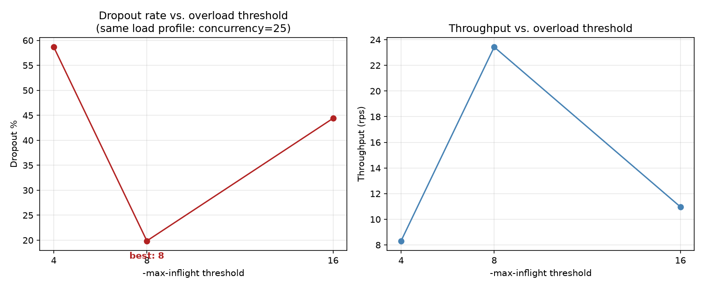
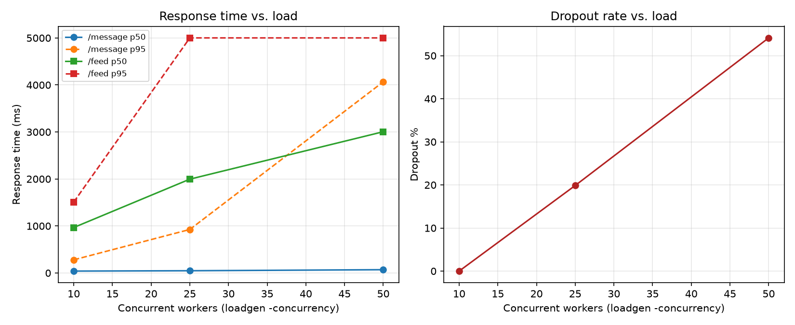
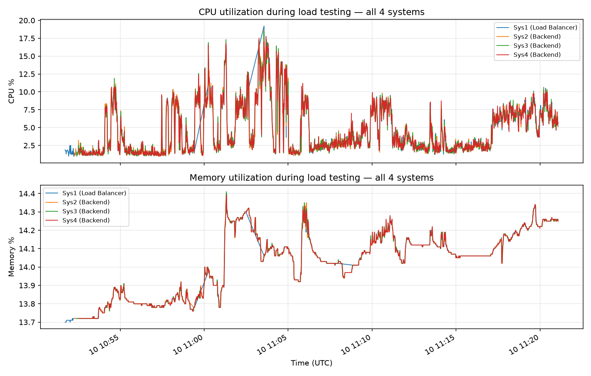
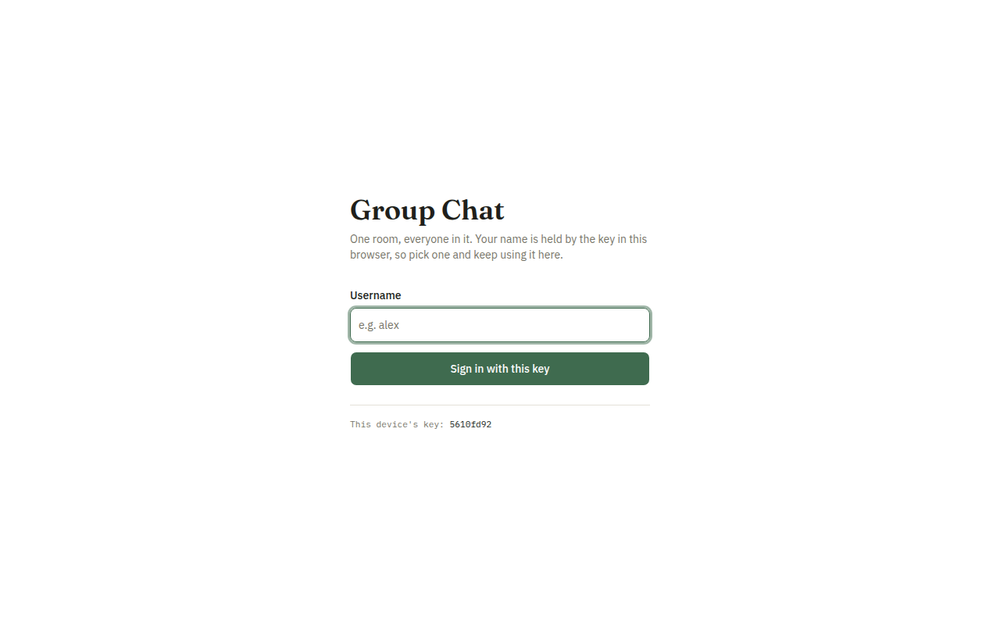
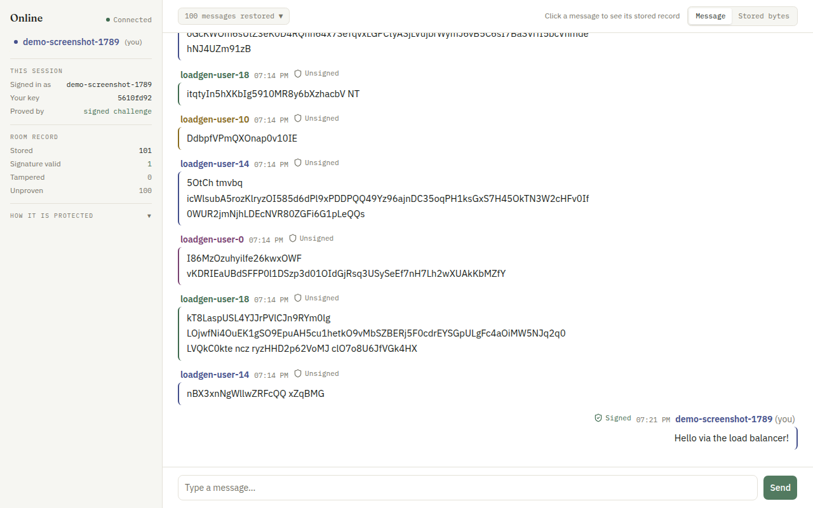

# Load Balancer Assignment Report

## Student Name
(fill in)

## Roll Number
(fill in)

## Assigned Systems

| System | Role            | Address           |
|--------|-----------------|-------------------|
| Sys1   | Load Balancer   | 10.1.75.53:4285 (HTTPS) |
| Sys2   | Backend copy 1  | 10.1.75.53:4286   |
| Sys3   | Backend copy 2  | 10.1.75.53:4287   |
| Sys4   | Backend copy 3  | 10.1.75.53:4288   |

All four are separate VMs sharing one physical host (`10.1.75.53`) — the
system-utilization plot below shows near-identical CPU/memory curves across
all 4 because of that shared-host contention, not a measurement error.

## Load Balancer Code

See `loadbalancer/main.go` (reverse proxy, performance-based dynamic backend
selection, health checks) and `loadgen/main.go` (load generator) in this
repository.

Backend: the existing `server/` messaging app (Node.js + Express + Socket.IO +
MongoDB), run as three independent, identically-configured copies on Sys2,
Sys3 and Sys4, all sharing one MongoDB Atlas cluster and one
`CHAT_ENCRYPTION_KEY` — that is what makes them share persistent chat data
rather than three separate histories. Required routes `POST /message` and
`GET /feed` are exposed by every backend and proxied through unchanged, so the
load balancer's own URL is what gets submitted.

## Dynamic Load Balancing

`candidateBackends()` (`loadbalancer/main.go`) is **not** fixed round-robin.
Each request is routed to the currently least-loaded healthy backend, using
the in-flight-request count the load balancer already tracks per backend (no
cooperation needed from the Node process). A backend at or above
`-max-inflight` in-flight requests is treated as **overloaded**: still used as
a last resort so a request is never dropped while any backend is alive, but
never preferred over a less-loaded one. This is the dynamic switch-away
behavior — a backend that starts falling behind loses new traffic to its
peers immediately, without waiting for a health check to fail it outright.

Unhealthy/unavailable backends are handled separately and unconditionally:

- **Active check** — `healthLoop` polls each backend's `GET /health` every
  `-health-interval` and flips `Alive` off on a non-2xx/3xx response or a
  failed request.
- **Passive check** — the reverse proxy's `ErrorHandler` marks a backend dead
  immediately on a dial or response-header timeout, before anything is
  retried against it.

A dead backend never appears in `candidateBackends()`'s output regardless of
its load score.

### Threshold (`-max-inflight`)

Chosen value: **8** (the default). Determined by running the identical load
profile (`loadgen -concurrency 25 -users 25 -feed-ratio 0.15`, see
`loadgen/results/threshold-comparison.csv` and `loadgen/results/comparison.csv`
row `medium-load-c25`) against the load balancer restarted at three different
`-max-inflight` values:

| `-max-inflight` | Throughput (rps) | /message p95 (ms) | Dropout % |
|---|---|---|---|
| 4  | 8.3  | 3041.7 | 58.67% |
| **8**  | **23.4** | **925.8**  | **19.87%** |
| 16 | 11.0 | 3869.2 | 44.40% |



8 is a clear sweet spot, not just "closer to the default is safer": too low
(4) marks backends overloaded almost immediately without actually reducing
the load reaching them (the threshold only reorders *preference*, it isn't
admission control), so it buys nothing while still adding overhead; too high
(16) lets one backend absorb too much before the load balancer reacts and
starts preferring another. Both mistuned values roughly halve throughput and
triple-plus the dropout rate relative to 8.

## Response Time vs. Load

Own `loadgen` (`loadgen/main.go`) run against the live load balancer URL at
three concurrency levels, each with randomized message length, randomized
inter-message interval per simulated user, and a mix of `/message` and
`/feed` traffic (`-feed-ratio 0.15`). Full rows in
`loadgen/results/comparison.csv`.

| Experiment | Concurrency | Users | RPS | Dropout % | /message p50 (ms) | /message p95 (ms) | /feed p50 (ms) | /feed p95 (ms) |
|---|---|---|---|---|---|---|---|---|
| low-load-c10    | 10 | 10 | 12.8 | 0.00%  | 40.2 | 279.9  | 967.1  | 1508.7 |
| medium-load-c25 | 25 | 25 | 23.4 | 19.87% | 47.5 | 925.8  | 1995.8 | 5001.3 |
| higher-load-c50 | 50 | 50 | 17.1 | 54.13% | 69.7 | 4066.8 | 3004.9 | 5001.1 |



### Observations

- **`/message` stays cheap at every load level tested** (p50 under 70ms even
  at concurrency 50) — writes are fast because they're one encrypt + one
  MongoDB insert.
- **`/feed` is the actual bottleneck**, not backend selection. Its p50 grows
  from ~1s to 3s+ across these runs because it decrypts and re-verifies the
  signature of *every* stored message on every call — a cost that scales with
  total chat history, not with request rate. Almost all dropout in these runs
  is `/feed` requests hitting loadgen's 5s client timeout, visible in the
  `context deadline exceeded` errors reported per run.
- This means the dynamic load balancing is doing its job (spreading load
  across healthy, least-loaded backends — see the threshold section above);
  the remaining bottleneck at high concurrency is `/feed`'s per-request cost
  on whichever backend serves it, independent of which backend that is.

## System Utilization (all 4 systems)

CPU and memory sampled once per second on all 4 systems throughout the load
tests above, via `loadgen/monitor.sh` (raw `/proc` parsing, no dependencies).
Raw data: `monitor_results/{lb,server1,server2,server3}`.



CPU spikes clearly track the load test windows (idle baseline ~1-2%, up to
~15-19% during the concurrency-50 run); all 4 curves move together because
these VMs share one physical host.

## Evidence

### Load balancer status — all backends alive, dynamic-selection fields present

```
$ curl -sk https://10.1.75.53:4285/lb/status
{
    "overload_threshold": 8,
    "backends": [
        {"url": "http://10.1.75.53:4286", "alive": true, "in_flight": 0, "overloaded": false},
        {"url": "http://10.1.75.53:4287", "alive": true, "in_flight": 0, "overloaded": false},
        {"url": "http://10.1.75.53:4288", "alive": true, "in_flight": 0, "overloaded": false}
    ]
}
```

### Chat app working through the load balancer (browser, HTTPS)

The login screen generating a WebCrypto signing key — only possible because
the page is served over a genuine secure context (HTTPS terminated at the
load balancer):



After signing in: 100 messages restored from persistent storage (a mix of
messages submitted earlier via `loadgen`'s `POST /message` calls and this
live browser session), plus one freshly sent, signed message going out
through the load balancer:



### `/message` idempotency — retried id is deduplicated

```
$ curl -sk -X POST https://10.1.75.53:4285/message -H "Content-Type: application/json" \
    -d '{"client-name":"report-demo","msg":"duplicate-id demo message","id":"report-demo-dup-1"}'
{"id":"6aa2b5f957ac46acecbd1b65","duplicate":false}

$ curl -sk -X POST https://10.1.75.53:4285/message -H "Content-Type: application/json" \
    -d '{"client-name":"report-demo","msg":"duplicate-id demo message","id":"report-demo-dup-1"}'
{"id":"6aa2b5f957ac46acecbd1b65","duplicate":true}
```

`GET /feed` confirms the retried id was stored exactly once, not twice:

```
$ curl -sk https://10.1.75.53:4285/feed | python3 -c "
import json, sys
data = json.load(sys.stdin)
print(sum(1 for m in data['messages'] if m['id'] == '6aa2b5f957ac46acecbd1b65'))
"
1
```

### `loadgen` terminal output (medium-load-c25 run)

```
$ ./loadgen -url https://10.1.75.53:4285 -requests 750 -concurrency 25 -users 25 \
    -feed-ratio 0.15 -min-msg-len 10 -max-msg-len 150 \
    -min-interval-ms 100 -max-interval-ms 500 -insecure \
    -experiment medium-load-c25 -out results/medium-load-c25.json -csv results/comparison.csv

experiment=medium-load-c25 requests=750 concurrency=25 users=25 feed_ratio=0.15
  successful=601 failed=149 dropout=19.87%
  throughput=23.4 rps  (elapsed 25.65s)
  overall  p50=51.5ms p95=2397.2ms p99=5001.2ms
  /message n=626 p50=47.5ms p95=925.8ms
  /feed    n=124 p50=1995.8ms p95=5001.3ms
  first error: Get "https://10.1.75.53:4285/feed": context deadline exceeded (Client.Timeout exceeded while awaiting headers)
```

## Integration with the Previous (Group) Assignment
- Previously graded messaging app URL: (fill in)
- Confirms it now resolves through the load balancer: (yes/no + how verified)
